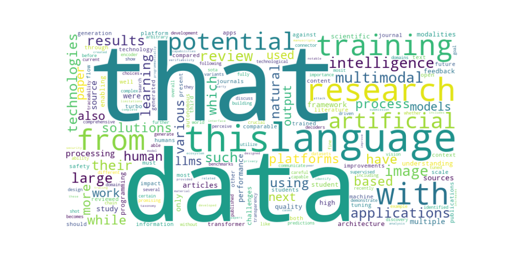

# AIOSRSE-UPM

## Description
This repository contains deliverables related to Artificial Intelligence and Open Science in Research Software Engineering. Currently, it only contains IndividualAssessment, which is a Grobid client that extracts links, generates a word cloud from abstracts, and creates a figure-per-article graph from PDF papers.

## Requirements
This project has a dependency file named requirements.txt, located inside the docs folder. To install the dependencies, run:

    pip install -r requirements.txt

## Installation
1. Clone the repository:
```bash
   git clone https://github.com/AlRos14/AIOSRSE-UPM.git
   cd IndividualAssesment
```

2. Create and activate a virtual environment (optional but recommended):
```bash
    python3 -m venv env
    source env/bin/activate  # On Windows: env\Scripts\activate
```

3. Install the required dependencies:
```bash
    pip install -r requirements.txt
```

4. Verify the installation:
```bash
    python main.py --help
```

## Execution

### Requirements
It is mandatory to have a running Grobid instance, as this project is essentially a Grobid client.
Additionally, Python dependencies must be installed from the requirements.txt file.

### Before running the project
Before running, PDFs should be placed in the data folder inside IndividualAssessment.

### Running the Project
To run the project, use the following command:
```bash
python main.py
```

### After running the project
An output folder will be created, containing three files: figures_per_article.png, keyword_cloud.png and link.txt

## Running Example(s)
This is a running example using ten AI-related articles:

    python main.py       
    2025-02-18 14:07:58,742 - INFO - Iniciando el análisis de artículos...
    2025-02-18 14:07:58,742 - INFO - Processing: 2305.04532v2.pdf
    2025-02-18 14:08:32,068 - INFO - Processing: 2309.05519v3.pdf
    2025-02-18 14:08:38,456 - INFO - Processing: 2403.09611v4.pdf
    2025-02-18 14:08:44,838 - INFO - Processing: 2404.17605v1.pdf
    2025-02-18 14:08:48,925 - INFO - Processing: 31664-Article Text-35728-1-2-20241016.pdf
    2025-02-18 14:08:51,934 - INFO - Processing: 3649217.3653594.pdf
    2025-02-18 14:08:55,379 - INFO - Processing: AIp2300031.pdf
    2025-02-18 14:08:57,199 - INFO - Processing: GPT-4Vision_for_Robotics_Multimodal_Task_Planning_From_Human_Demonstration.pdf
    2025-02-18 14:09:00,477 - INFO - Processing: GPT_Generative_Pre-Trained_Transformer_A_Comprehensive_Review_on_Enabling_Technologies_Potential_Applications_Emerging_Challenges_and.pdf
    2025-02-18 14:09:10,667 - INFO - Processing: RTLCoder_Outperforming_GPT-3.5_in_Design_RTL_Generation_with_Our_Open-Source_Dataset_and_Lightweight_Solution.pdf
    2025-02-18 14:09:15,003 - INFO - Análisis completado. Resultados guardados en la carpeta output/

figures_per_article.png:

keyword_cloud.png:

links.txt:
[links](IndividualAssessment/output/links.txt)

## Preferred Citation
A citation file is included in this repository. Please refer to the `CITATION.cff` file for proper citation format.

